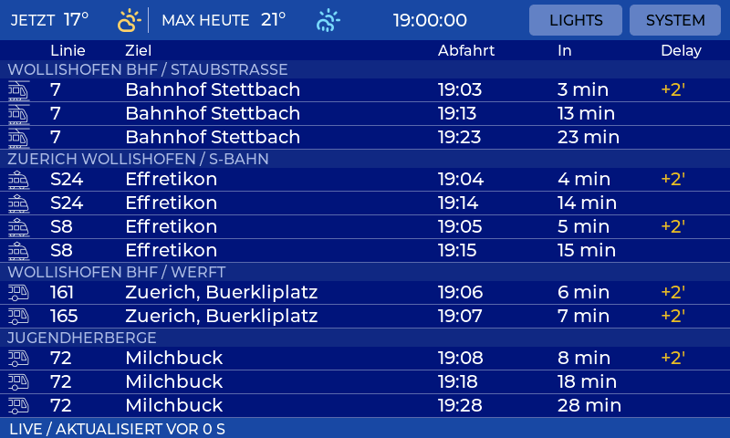
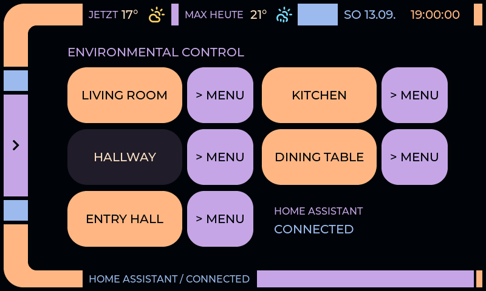

# LCARS Home & Zürich Transit Controller

A wall-mounted touchscreen for Home Assistant lighting and Zürich public
transport, built for the **Freenove FNK0115Q** ESP32-S3 5-inch display.

The home controls use a Star Trek: The Next Generation-inspired LCARS interface.
The transit page follows the local departure-board style: blue background,
white transport icons and yellow delays. Updates are installed over Wi-Fi.



*Layout preview rendered from the actual LVGL interface; the times are test data.*

## Features

- **Twelve departures at a glance:** selected tram, S-Bahn and bus services,
  with destination, departure time, countdown and delay.
- **Weather in the transit header:** current temperature and condition, today's
  forecast high and condition, fetched from Open-Meteo.
- **Home Assistant lights:** Living Room, Kitchen, Hallway, Dining Table and
  Entry Hall, with separate power and submenu buttons.
- **Living Room scenes:** 18 scene selections and a brightness slider.
- **System controls:** screen brightness, saved 180° rotation and speaker volume.
- **Touch feedback:** distinct Star Trek-style sounds for menu navigation and
  control actions, with mute at zero volume, buffered playback and no overlapping clips during rapid taps.
- **Wi-Fi updates:** encrypted ESPHome API and password-protected OTA.
- **Optional FAT32 storage:** remote diagnostics and explicit storage tests.
- **Printable case:** a slim enclosure with a flat back and a speaker/cable bay.

The device starts on TRANSIT. Tap **LIGHTS** or **SYSTEM** at the top to open
LCARS; **TRANSIT** in its sidebar returns to departures.



## Hardware

| Part | Configuration |
| --- | --- |
| Board | Freenove FNK0115Q, ESP32-S3, 16 MB flash, 8 MB octal PSRAM |
| Display | 5-inch IPS, 800 × 480, GT911 capacitive touch |
| Power | USB-C; tested with the supplied USB-A-to-C cable and a 5 V / 2 A supply |
| Speaker | Supplied two-wire speaker connected to the board's **Speak** socket |
| Wi-Fi | 2.4 GHz |
| Storage | Optional microSD; tested with a 32 GB card formatted FAT32 |

This configuration targets **FNK0115Q**, not the other Freenove display variants.
The Home Assistant and transit pages do not require an SD card. Both feedback
clips and the transit icons are embedded in firmware.

Audio uses GPIO0/18/17 for BCLK/LRCLK/data. Touch polls over I²C, leaving GPIO18
available for audio. SD uses GPIO10/12/13/11 for CS/clock/MISO/MOSI. HTTPS buffers
and larger allocations use PSRAM; internal RAM is reserved for system tasks.

ESPHome 2026.8.2 requests an LCD DMA restart in every `mipi_rgb` loop pass.
The display configuration disables that loop after initialization because LVGL
draws directly to the RGB frame buffer. The transit client reuses one HTTPS
connection for its four stop requests per minute; a live refresh used one
connection and returned all six route groups. The 64-byte cache-line setting
below eliminated the remaining refresh flicker on the physical panel.
Review the display workaround when upgrading ESPHome.

The ESP32-S3 data cache uses 64-byte lines as recommended for RGB bounce-buffer
mode; the default 32-byte setting can disrupt display output under memory load.

## Set up and build

The tested toolchain is **Python 3.13, ESPHome 2026.8.2, ESP-IDF 5.5.5 and
LVGL 9.5.0**. ESPHome downloads its firmware dependencies during the first build.

```sh
git clone https://github.com/ugubser/esp32.git
cd esp32
python3 -m venv .venv-esphome
.venv-esphome/bin/python -m pip install -r requirements-esphome.txt
cp .env.example .env
```

Edit `.env` with your Wi-Fi credentials and transit API token, then run:

```sh
.venv-esphome/bin/python scripts/prepare_secrets.py
.venv-esphome/bin/python -m esphome compile firmware/lcars.yaml
```

The preparation script creates `firmware/secrets.yaml`, generates an API
encryption key and OTA password, and preserves those keys on subsequent runs.
Both credential files are restricted to the local user. Back up your generated
secrets privately: an existing device expects the same API/OTA credentials.
The administrative Home Assistant token is never copied into firmware.

### Install and update

For first installation, connect the board to the computer with a USB **data**
cable and select its serial port:

```sh
.venv-esphome/bin/python -m esphome upload firmware/lcars.yaml --device /dev/cu.usbserial-XXXX
```

Replace the example port with your board's actual port; Linux ports usually
look like `/dev/ttyUSB0`. Use the USB route if the device does not yet run this
firmware. BOOT/RESET may be needed to enter the bootloader on an unconfigured board.

Once the device joins Wi-Fi, updates use its local hostname:

```sh
.venv-esphome/bin/python -m esphome upload firmware/lcars.yaml --device lcars-controller.local
.venv-esphome/bin/python -m esphome logs firmware/lcars.yaml --device lcars-controller.local
```

The hostname resolves through mDNS; use the device's current IP address if your
network does not resolve local hostnames. Keep power connected during updates.
On this board, opening a USB serial monitor can reset the controller. After an
OTA update, allow at least a minute of uninterrupted operation before resetting
or opening a serial monitor; use network logs to inspect startup.

There is no provisioning access point. To change networks, update `.env`,
regenerate secrets and upload while the old connection is still available,
or reconnect by USB.

## Home Assistant

Add the **ESPHome** integration in Home Assistant using
`lcars-controller.local` and the API encryption key from your local
`firmware/secrets.yaml`. Enable the integration option that permits the device
to perform Home Assistant actions.

The repository includes the owner's room, entity and scene configuration.
For another installation, update both:

- [`firmware/lighting_config.h`](firmware/lighting_config.h): room membership,
  entity identifiers and scene labels.
- [`firmware/lcars.yaml`](firmware/lcars.yaml): matching state subscriptions and
  Home Assistant action calls.

The [lighting map](docs/lighting-map.md) describes the current configuration.
Unavailable or pending controls are disabled, and late responses do not finish
newer requests.

## Weather

The transit header shows **JETZT** with the current temperature and condition,
then **MAX HEUTE** with the forecast high and the day's overall condition.
The icons distinguish clear, partly cloudy, overcast, fog, drizzle, rain,
showers, snow and thunderstorms. Current conditions use sun or moon variants
according to the time of day. Missing or stale data shows `--°` and `?`.

The controller reads the coordinates from Home Assistant's `zone.home` and
requests [Open-Meteo's forecast API](https://open-meteo.com/en/docs) directly
over HTTPS. There is no weather API key. It refreshes every 30 minutes, retries
failures after five minutes, and refreshes when the local day changes. The
Home Assistant **Weather Status** diagnostic sensor reports the last result.
The icons use Open-Meteo's current and daily WMO weather codes; the daily code
represents the most severe condition predicted that day. The embedded
[Lucide weather icons](firmware/weather_assets/README.md) need no runtime download.
Weather requires the Home Assistant connection to provide `zone.home`.

## Transit

The companion service at `https://transit.tribecans.com/api` requires a bearer
token. Set **`TRANSIT_API_KEY`** in `.env`; the service and its credentials are
not included in this repository. See the [API contract and notes](docs/transit-api.md).

| Route | Direction | Stop ID | Rows |
| --- | --- | --- | ---: |
| Tram 7 | Bahnhof Stettbach | `8591081` | 3 |
| S24 | Weinfelden / Thayngen / temporary Effretikon terminus | `8503009` | 2 |
| S8 | Winterthur / temporary Effretikon terminus | `8503009` | 2 |
| Bus 161 | Zürich, Bürkliplatz | `ch:1:sloid:91080` | 1 |
| Bus 165 | Zürich, Bürkliplatz | `ch:1:sloid:91080` | 1 |
| Bus 72 | Milchbuck | `8591216` | 3 |

Change route selection in [`firmware/transit_model.h`](firmware/transit_model.h).
The client requests each of the four distinct stops once a minute, with up to
60 results per stop, then selects the configured number of departures per route.
The service may cache results for two minutes. Countdowns update every second;
SNTP supplies the clock and Europe/Zurich controls local time and daylight saving.

The API's departure timestamp already includes its realtime estimate; delay is
not added twice. The selected routes determine their icons because the API's
category field is unreliable. Expired departures disappear. Offline, failed or
older-than-three-minute responses produce a visible unavailable status.
HTTPS verifies the server certificate and does not follow redirects with the token.

## SD card

FAT32 storage is optional. Startup only reads card metadata: **it never formats
or writes to the card**. The encrypted API exposes `SD Card Status` and the
`sd_card_maintenance` action:

| Command | Effect |
| --- | --- |
| `FORMAT_EXFAT_TO_FAT32` | **Erases the detected exFAT card**, creates FAT32 and runs the first test stage. Requires an explicit command. |
| `TEST_STORAGE` | Writes, syncs, reads and renames a 256 KB test file without formatting. |
| `VERIFY_AFTER_REBOOT` | Verifies the saved file after restart, then deletes the file and test directory. |

Tests refuse to overwrite an existing test directory. Failed readback preserves
the file for diagnosis. A live test passed writing, byte-for-byte readback,
renaming, a controller restart, second readback and deletion. This is a functional
test, not a whole-card capacity or endurance test. General file upload/download
management is not implemented yet.

## Wall case

The current [slim revision 3](case/README.md) measures **143 × 124 × 18 mm**.
Its full-width speaker bay has front vents and cable space; the back is flat
for adhesive strips. STL files, an editable STEP assembly, source and a fit
gauge are included under [`case/slim-v3`](case/slim-v3).

**Known fit issue:** the printed case needed a manual USB cut-out because the
opening was on the opposite side. The committed CAD/STLs retain that geometry;
check and correct the opening for your assembly before printing. The enclosure
remains a prototype even though the owner's modified print is in use.

## Tests

After the first firmware compilation, native tests reuse the same downloaded
LVGL and cJSON sources. Install CMake 3.19+ and a C/C++17 compiler, then run:

```sh
python3 -m unittest discover -s tests -p 'test_*.py' -v
cmake -S tests -B firmware/build/ui-tests
cmake --build firmware/build/ui-tests -j 6
ctest --test-dir firmware/build/ui-tests --output-on-failure
```

Tests cover secrets, lighting state and requests, PCM playback, SD signatures
and file operations, transit and weather parsing/filtering/expiry, and actual
LVGL rendering and touch-event routing. UI previews are generated under ignored `logs/`.
Physical touch alignment, speaker output and case fit also require device checks.
Optional CAD tests require CadQuery: `python -m unittest discover -s case -p 'test_*.py'`.

## Repository and credentials

| Directory | Contents |
| --- | --- |
| `firmware/` | ESPHome configuration, UI, state machines, storage and transit client |
| `scripts/` | Local credential preparation |
| `tests/` | Native C++/LVGL and Python tests |
| `docs/` | Integration notes and layout previews |
| `case/` | Parametric CAD, current exports and earlier design revisions |

`.gitignore` excludes `.env` files (except the template), generated secrets,
private keys, firmware binaries, build trees, virtual environments, logs,
backups and local audit/history notes. **Compiled firmware contains credentials;
do not attach it to public releases.**

## Credits

Hardware and examples: [Freenove FNK0115 documentation](https://docs.freenove.com/projects/fnk0115/en/latest/).
Firmware stack: [ESPHome](https://esphome.io/) and [LVGL](https://lvgl.io/).
Transit icons and palette come from the companion transit-board application.
Weather icons are from [Lucide](https://lucide.dev/) under its
[included license](firmware/weather_assets/LUCIDE-LICENSE).
The current feedback and earlier sound assets are credited in
[`firmware/audio/README.md`](firmware/audio/README.md). This personal project is
not affiliated with Star Trek, SBB or ZVV; no ownership or blanket redistribution
licence is claimed for third-party names, sounds or artwork.
